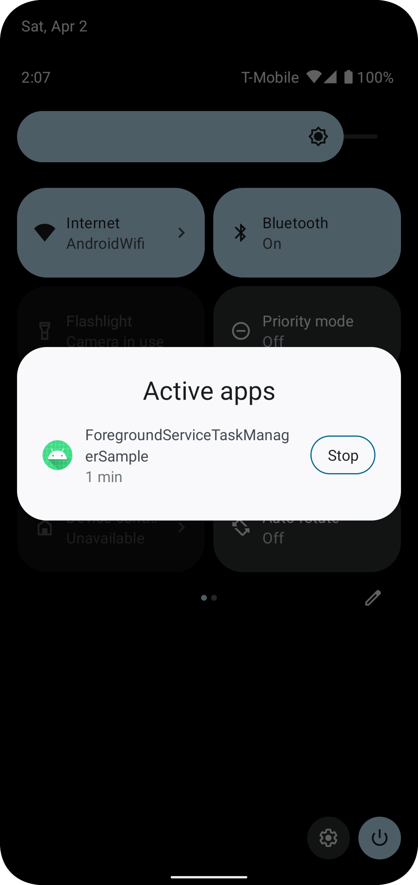

# ForegroundServiceTaskManagerSample

https://developer.android.com/about/versions/13/changes/fgs-manager

`targetSdkVersion`に関わらずAndroid 13のデバイスからForeground Service Task Managerと呼ばれる項目が表示され起動中のForeground Serviceの一覧が表示される。
さらに停止ボタンが表示されており、Foreground Serviceをユーザが停止することが可能となっている。

## スクリーンショット

